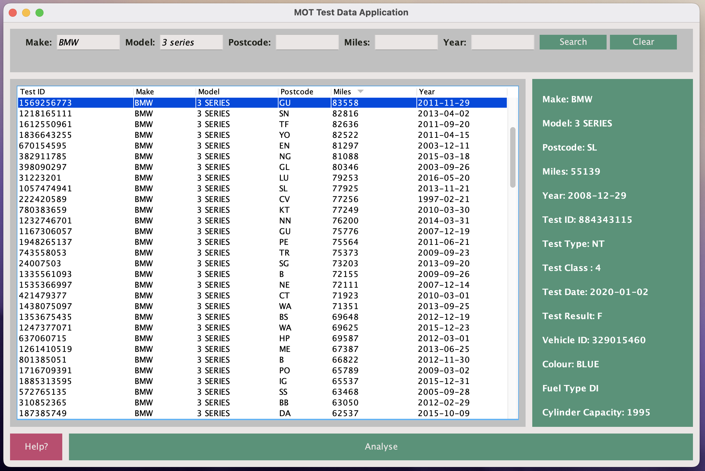
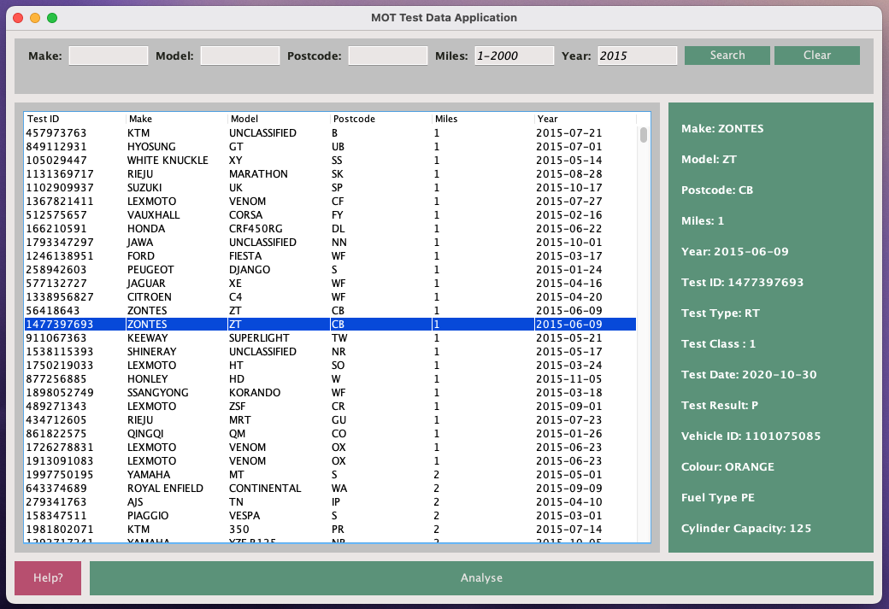
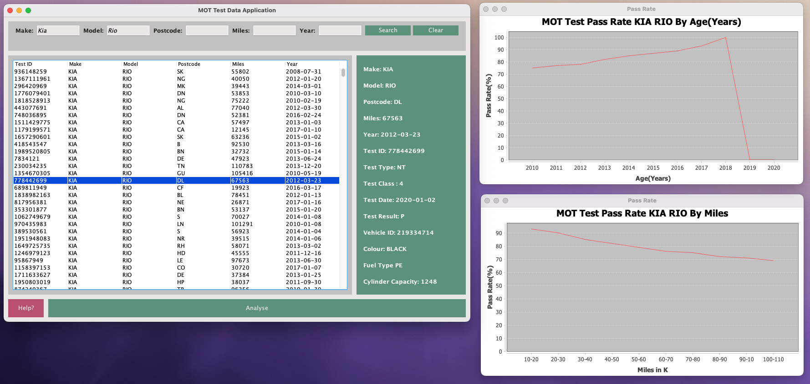
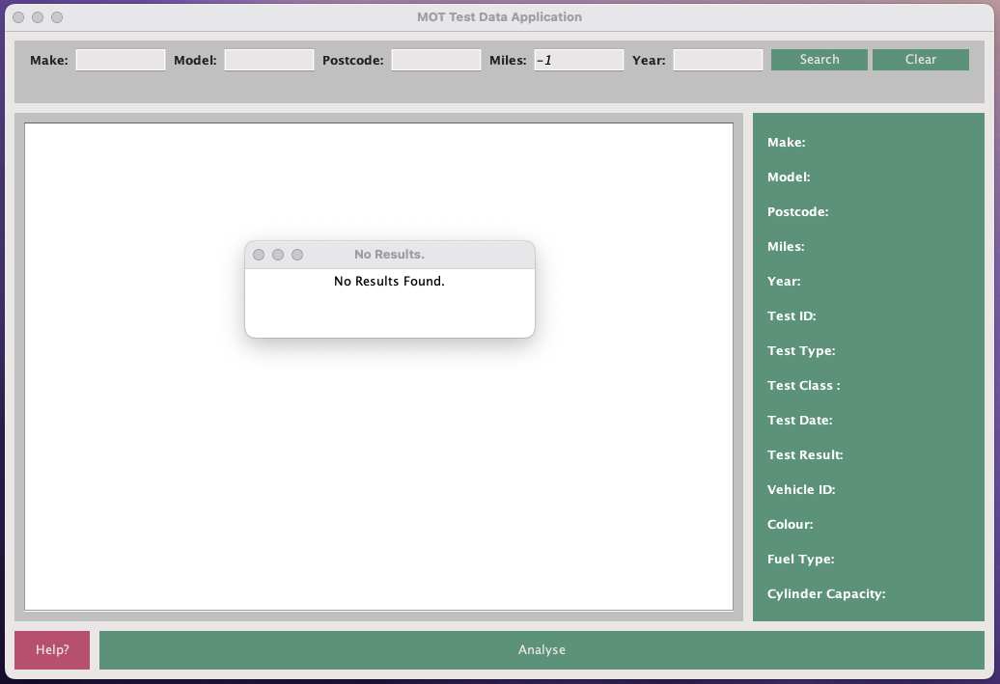

# Advanced Programming Assingment - Y2

The assignment required the creation of a desktop Java application capable of browsing and performing basic statistical analysis on the UK's Department for Transport's MOT test dataset. The dataset, which was published annually, contained anonymized information about each MOT test performed on road vehicles. The goal was to develop a Java application that imported the dataset into an SQLite database and provided a user-friendly interface for searching, displaying, and analyzing the data.

The assignment was divided into two main components: the Data Import Program and the Desktop Application.

The Data Import Program, which carried a weightage of 30%, involved creating a program that imported the dataset from CSV files into an SQLite database using JDBC. The program searched for CSV files in the working directory, created an SQLite database in the same location, and handled any existing databases. It also defined the table structure based on the provided entity-relation model and inserted the data into the appropriate tables. Error handling, progress updates, and code quality were assessed for this component.

The Desktop Application, which carried a weightage of 70%, required developing a Java desktop application with a Swing user interface. The application offered basic search and display functionality, allowing users to search for tests based on make, model, first use year, and mileage range. The matching test results were displayed in a JTable component, and detailed information about a selected test was viewable. Furthermore, the application included analysis and reporting features using the JFreeChart library to generate graphs depicting pass rates for specific makes and models by age or mileage. The Swing user interface was visually appealing, user-friendly, and responsive. Code quality, including class structure, readability, and comments, was also evaluated.

NOTE: Both programs can be found in ./src/

# Screenshots of Desktop Application
BMW 3 series result sorted by milage.

2015 Vehicles under 2k miles

Analysis of Results

No Results Found

